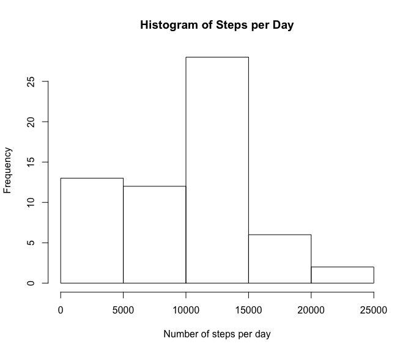
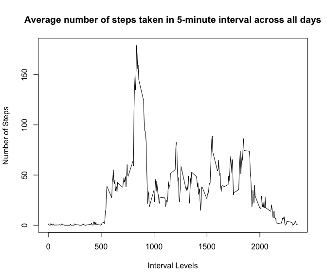
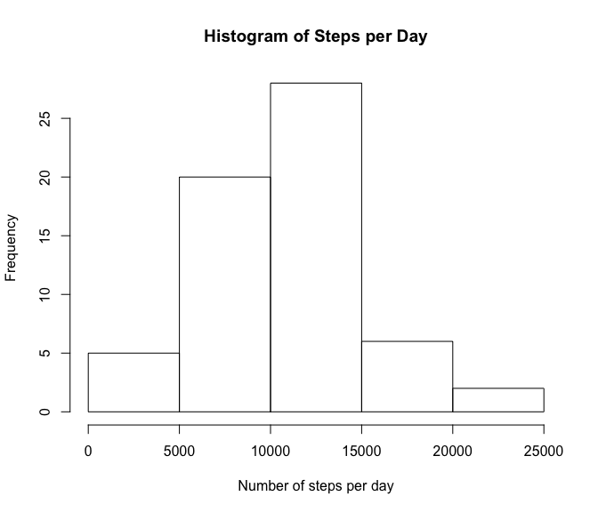
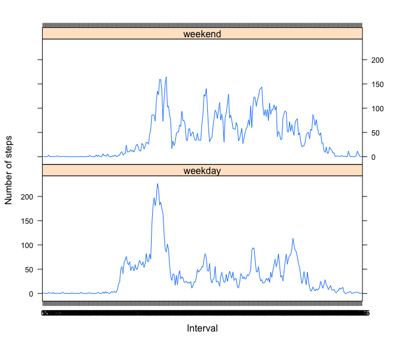

# Reproducible Research: Peer Assessment 1


## Loading and preprocessing the data
First of all, it's necessary load all the activity data from our csv


```r
activity <- read.csv("activity.csv")
str(activity)
```

```
## 'data.frame':	17568 obs. of  3 variables:
##  $ steps   : int  NA NA NA NA NA NA NA NA NA NA ...
##  $ date    : Factor w/ 61 levels "2012-10-01","2012-10-02",..: 1 1 1 1 1 1 1 1 1 1 ...
##  $ interval: int  0 5 10 15 20 25 30 35 40 45 ...
```


## What is mean total number of steps taken per day?
To calculate the mean of the total number of steps taken per day, first of all we have to group steps by day


```r
steps_per_day <- tapply(activity$steps,activity$date,sum,na.rm=TRUE)
```

With these we are able to plot the *Histogram* that shows the frequency of steps_per_day


```r
hist(steps_per_day,xlab="Number of steps per day",main="Histogram of Steps per Day")
```

 

Now we have to calculate the mean 

```r
steps_mean <- mean(steps_per_day)
```
and the median

```r
steps_median <-median(steps_per_day)
```

So the mean is 9354.2295082 and the median is 10395 . 

## What is the average daily activity pattern?
To do this, first we have to calculate the average of steps taken in each interval


```r
activity$interval <- as.factor(activity$interval)
interval_levels <- levels(activity$interval)
date_levels <- levels(activity$date)
steps_average <- (tapply(activity$steps,activity$interval,sum,na.rm=TRUE) / length(date_levels))
```

Now we make the time series plot of the 5-minute interval and the average number of steps taken, averaged across all days


```r
plot(x = interval_levels, y = steps_average, type = "l", xlab = "Interval Levels", 
    ylab = "Number of Steps", main = "Average number of steps taken in 5-minute interval across all days")
```

 


```r
step_max <- max(steps_average)
step_max_interval <- names(steps_average[steps_average == step_max])
```

The maximum number of steps is 179.1311475 in the interval 835

## Imputing missing values

```r
missing_values <- sum(!complete.cases(activity$steps))
```

The total number òf missing values is 2304 .
Now we can replace NA values with the mean for that interval


```r
complete_activity <- activity
for (i in 1:length(complete_activity$steps)) {
    if (is.na(complete_activity$steps[i])) {
        for (j in 1:length(steps_average)) {
            if (as.character(complete_activity$interval[i]) == names(steps_average[j])) 
                complete_activity$steps[i] = steps_average[j]
        }
    }
}
```

And with those values we can calculate the histogram of the total steps per day including the predict values of NA steps


```r
steps_complete_per_day <- tapply(complete_activity$steps,complete_activity$date,sum,na.rm=TRUE)
hist(steps_complete_per_day,xlab="Number of steps per day",main="Histogram of Steps per Day")
```

 

Now we have to re-calculate the mean 


```r
steps_complete_mean <- mean(steps_complete_per_day)
```

and the median


```r
steps_complete_median <-median(steps_complete_per_day)
```

So the recalculated (including the predict NA values of steps) mean is 1.0581014\times 10^{4} and the median is 1.0395\times 10^{4} .


The differences with the previous calculated mean and median are respectly 1226.7841978 and 0 . 


## Are there differences in activity patterns between weekdays and weekends?


First of all, we have to identify correctly the weekdays and the weekends in the data adding two columns "day" and "day_type". The "day" column will contain the name of the day and the "day_type" column will contain a factor of "weekend" and "weekday":


```r
complete_activity$day<- weekdays(as.Date(complete_activity$date))
complete_activity$day_type[complete_activity$day  %in% c('Saturday','Sunday') ] <- "weekend"
complete_activity$day_type[!(complete_activity$day  %in% c('Saturday','Sunday'))] <- "weekday"
complete_activity$day_type <- as.factor(complete_activity$day_type)
```

Then we can calculate the average steps by interval across all day


```r
steps_by_interval <- aggregate(steps ~ interval + day_type, complete_activity, mean)
```
And now we can plot the differences (using *lattice* package):


```r
library(lattice)
xyplot(steps ~ interval | day_type, steps_by_interval, type = "l", layout = c(1, 2), 
    xlab = "Interval", ylab = "Number of steps")
```

 


